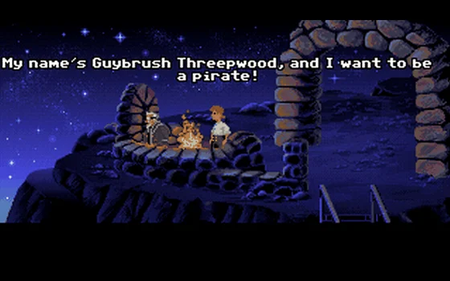
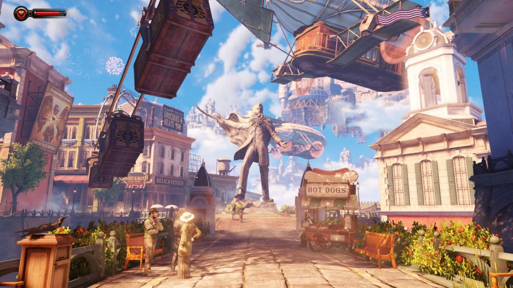

Here are some games that I really enjoyed - they aren't necessarily inspiration for my current project - but games that inspired me and captured my imagination (and time). I expect to add to this list over time.

### Ecco the Dolphin

One of the first games I played. Loved the feeling of diving deeper and deeper into the unknown (might be why I enjoyed Subnautica so much).

### Comix Zone

This had a novel art style, where everything was drawn into the scene by an artist "literally". Navigating between scenes was jumping across the pages, tearing parts of the paper. Very creative.

### The Secret of Monkey Island

Great puzzles, funny dialogue, classic.

### Seven Kingdoms

Interesting mechanics around population, integrating different races.

### Settlers 3

The territory mechanic of Settlers 3 was fantastic, and to my knowledge hasn't been done as well since. You can expand your territory with special settlers, but only cement the territory with towers.

### Half-Life 1 & 2

Classic. Spawned an amazing modding scene. Both games were revolutionary for their time.

### Counter-Strike 1.6

I spent about 10 years playing Counter-Strike, semi-professionally. Nothing has matched the gameplay "feel" to me since. This could obviously be nostalgia, but something about the way enemies fly back after being headshot felt amazing. Also had an innovative economy, and classic maps that stood the test of time and are still fun more than 15 years later.

### World of Warcraft

Great social experience, but this was the first game where I fell in love with the world. Each zone was distinct and recognizable, had its own music, different NPCs. It was scary as a low level to visit high level places - but you knew at some point you'd be strong enough to venture further.

### Bioshock Infinite

The art style of Bioshock Infinite drew me in, having been a huge fan of the previous games - this one became an instant classic for me. As far as story-writing in games goes, this was the pinnacle for me. The closing scene left me speechless for minutes. I would love to make a game that has this effect on players.

### Farcry 5

I had low expectations of FC5, but it really blew me away. This is another game where the world felt like a character itself. It felt technologically impressive in its scale, and everything in the world felt "alive". Characters, wildlife, plants. The story on top of this was really just a bonus, and it was a gift to journey through.

